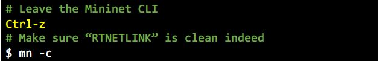

# Route Configuration

This repository is a lab for NCTU course "Introduction to Computer Networks 2018".

---
## Abstract

In this lab, we are going to write a Python program with Ryu SDN framework to build a simple software-defined network and compare the different between two forwarding rules.

---
## Objectives

1. Learn how to build a simple software-defined networking with Ryu SDN framework
2. Learn how to add forwarding rule into each OpenFlow switch

---
## Execution

> TODO:
> * How to run your program?
To run the program, we do the following steps:
1. Run topology 
* Run topology in one terminal first <br />

* Then, run the controller in another terminal

2. Measure the bandwidth 
* Use the following iPerf commands to measure the bandwidth in your network

* Leave topo.py in one terminal first

* Then, leave SimpleController.py in another terminal

3.
> * What is the meaning of the executing command (both Mininet and Ryu controller)?
> * Show the screenshot of using iPerf command in Mininet (both `SimpleController.py` and `controller.py`)


---
## Description

### Tasks

> TODO:
> * Describe how you finish this work in detail

1. Environment Setup <br />
Step 1: Join this lab on GitHub Classroom <br />
Step 2: Login to container using SSH <br />
* for my case, I used Putty to access my container.<br />
Step 3: Clone your GitHub repository <br />
Step 4: Run Mininet for testing <br />
2. Example of Ryu SDN <br />
Step 1: Login to container in two terminals <br />
Step 2: Run Mininet topology in one terminal first <br />
<br />
Step 3: Run Ryu manager with controller in anohter terminal <br />
<br />
Step 4: To leave the leave the Ryu controller: <br />
* Leave topology in one terminal first<br />
<br />
* Then, leave controller in another terminal<br />
<br />

3. Mininet Topology
Step 1: Build the topology via Mininet<br />
* Duplicate the example code SimpleTopo.py and name it topo.py<br />
> `$ cp SimpleTopo.py topo.py`<br />
* Add the constraints (e.g., bandwidth, delay, and loss rate) by /Route_Configuration/src/topo/topo.png<br />
* Topology of /Route_Configuration/src/topo/topo.png<br />
<br />
Step 2: Run Mininet topology and controller<br />
* Run topo in one terminal first<br />
* Then, run controller in another terminal<br />

4. Ryu Controller
Step 1: Trace the code of Ryu controller<br />
Step 2: Write another Ryu controller<br />
* Duplicate the example code SimpleController.py and name it controller.py<br />
* Follow the forwarding rules in the picture below and modify controller.py<br />
* Forwarding rules (for controller.py)<br />


5. Measurement
Step 1: Run topology with SimpleController.py<br />
* Run topo.py in one terminal first <br />
* Then, run SimpleController.py in another terminal<br />
Step 2: Measure the bandwidth<br />
* Use the following iPerf commmands to measure the bandwidth in your network<br />

* Leave topo.py in one terminal first<br />
* Then, leave SimpleController.py in another terminal<br />


### Discussion

> TODO:
> * Answer the following questions

1. Describe the difference between packet-in and packet-out in detail.<br />
To describe packet-in and packet-out in detail, we define the following terms:<br />
* **Packet**: an Ethernet frame, including header and payload.<br />
* **Port**: where packets enter and exit the OpenFlow pipeline. May be a physical port, a logical port defined by the switch, or a reserved port defined by the OpenFlow protocol.<br />
* **OpenFlow Pipeline**: the set of linked flow tables that provide matching, forwarding, and packet modifications in an OpenFlow switch. <br />

> Packet-in are packets that are received into the OpenFlow switch through the ingress port which are then processed by the OpenFlow pipeline which may forward them to an output port.<br />

> Packet-out are packets that are sent back to the network through an output port of the OpenFlow pipeline, using the output action which defines how the packet goes back to the network.

   
2. What is “table-miss” in SDN? <br />
To define what is table-miss, we first have to define the following:<br />
* **Flow Table**: A stage of the pipeline, contains flow entries.<br />
* **Flow Entry**: an element in a flow table used to match and prcess packets. It contains a set of match fields for matching packets, a priority for matching precedence, a set of counters to track packets, and a set of instructions to apply.<br />
* **Match Field**: a field against which a packet is matched, including packet headers, the ingress port, and the metadata value. A match field may be wildcarded (match any value) and in some cases bitmasked.<br />
* **Metadata**: a maskable register value that is used to carry information from one table to the next.<br />

> When processed by a flow table, the packet is matched against the flow entries of the flow table to select a flow entry (see figure). If a packet does not match a flow entry in a flow table, this is a table miss. The behavior on a tbale miss depends on the table conifiguration (see figure). A table-miss flow entry in the flow table may specify how to process unmatched packets: Options include dropping them, passing them to another table or sending them to the controller over the control channel via packet-in messages.
   
3. Why is "`(app_manager.RyuApp)`" adding after the declaration of class in `controller.py`?
>`from ryu.base import app_manager`

>`class L2Forwarding(app_manager.RyuApp):`

>`    def __init__(self, *args, **kwargs):`

>`        super(L2Forwarding, self).__init__(*args, **kwargs)` <br />

* The main controller code is organised under the /ryu/ folder. The /ryu/base/ folder contains the base class for RYU applications. The RyuApp class in the app_manager.py file is inherited when creating a new application. <br />
<br />
By adding `(app_manager.RyuApp)` after the declaration of class in `controller.py`, a new application involving a subclass of RyuApp is created
   
4. Explain the following code in `controller.py`.
    ```python
    @set_ev_cls(ofp_event.EventOFPPacketIn, CONFIG_DISPATCHER)
    ```

5. What is the meaning of “datapath” in `controller.py`?
   
6. Why need to set "`ip_proto=17`" in the flow entry?
   
7. Compare the differences between the iPerf results of `SimpleController.py` and `controller.py` in detail.
   
8. Which forwarding rule is better? Why?

---
## References

> TODO: 
> * Please add your references in the following

* **Ryu SDN**
    * [Ryubook Documentation](https://osrg.github.io/ryu-book/en/html/)
    * [Ryubook [PDF]](https://osrg.github.io/ryu-book/en/Ryubook.pdf)
    * [Ryu 4.30 Documentation](https://github.com/mininet/mininet/wiki/Introduction-to-Mininet)
    * [Ryu Controller Tutorial](http://sdnhub.org/tutorials/ryu/)
    * [OpenFlow 1.3 Switch Specification](https://www.opennetworking.org/wp-content/uploads/2014/10/openflow-spec-v1.3.0.pdf)
    * [Ryubook 說明文件](https://osrg.github.io/ryu-book/zh_tw/html/)
    * [GitHub - Ryu Controller 教學專案](https://github.com/OSE-Lab/Learning-SDN/blob/master/Controller/Ryu/README.md)
    * [Ryu SDN 指南 – Pengfei Ni](https://feisky.gitbooks.io/sdn/sdn/ryu.html)
    * [OpenFlow 通訊協定](https://osrg.github.io/ryu-book/zh_tw/html/openflow_protocol.html)
* **Python**
    * [Python 2.7.15 Standard Library](https://docs.python.org/2/library/index.html)
    * [Python Tutorial - Tutorialspoint](https://www.tutorialspoint.com/python/)
* **Others**
    * [Cheat Sheet of Markdown Syntax](https://www.markdownguide.org/cheat-sheet)
    * [Vim Tutorial – Tutorialspoint](https://www.tutorialspoint.com/vim/index.htm)
    * [鳥哥的 Linux 私房菜 – 第九章、vim 程式編輯器](http://linux.vbird.org/linux_basic/0310vi.php)

---
## Contributors

> TODO:
> * Please replace "`YOUR_NAME`" and "`YOUR_GITHUB_LINK`" into yours

* [YOUR_NAME](YOUR_GITHUB_LINK)
* [David Lu](https://github.com/yungshenglu)

---
## License

GNU GENERAL PUBLIC LICENSE Version 3
